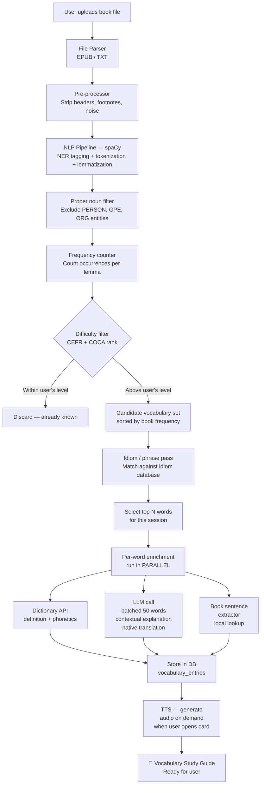

# 📚 VocabNet — Audiobook Vocabulary Learning App
### Planning & Design Document — v2

---

## Overview

**Problem**: Non-native English speakers who learn from audiobooks often encounter unfamiliar vocabulary and phrases mid-listen, disrupting immersion and comprehension. The disruption compounds — stopping to look up a word breaks the narrative flow, and by the time they return, they've lost context.

**Solution**: An app that ingests the full text of a book, identifies vocabulary and phrases that are likely difficult *for this specific user*, and generates a personalized study guide — *before* the user ever hits play.

**Core value proposition**: Preparation, not interruption. Learn the words in advance so listening can be pure enjoyment.

---

## Core User Journey

```
New User:
  1. Onboarding: set native language + estimated English level
  2. (Optional) Take a 3-minute vocabulary placement quiz to calibrate level
  3. Upload a book file (EPUB / TXT)
  4. App processes the text in the background (may take 1–3 minutes)
  5. User receives a personalized vocabulary study guide
  6. Study words/phrases at own pace — flashcards, quizzes, audio
  7. Listen to the audiobook with vastly improved comprehension

Returning User:
  1. Open saved book or upload a new one
  2. Resume study session — spaced repetition surfaces due words
  3. Mark words as mastered; see overall readiness score for the book
```

> [!IMPORTANT]
> The journey above assumes users have access to the **book's text** separately from the audiobook. This is a fundamental product constraint addressed in Challenge 6 below.

---

## Key Challenges & Proposed Solutions

---

### Challenge 1 — How to Define "Difficult"?

**The problem**: "Difficult" is highly personal. The same word can be trivial for one learner and completely opaque for another. A naive global difficulty score will produce too many false positives (words the user already knows) and false negatives (words the user thinks they know but actually misuse).

**Dimensions of "difficult"**:
- The user has *never seen* this word (true unknown)
- The user has seen the word but cannot *recall* it under pressure
- The user *thinks* they know it but has a subtly wrong meaning (dangerous — causes comprehension errors)
- The word is known in isolation but used *idiomatically* in this passage

**Possible approaches**:

| Approach | Description | Pros | Cons |
|---|---|---|---|
| **CEFR Level Mapping** | Words tagged A1–C2 by the Common European Framework. Filter above user's self-reported level. | Simple, proven, free datasets available | Self-reporting is often inaccurate (±1 level); CEFR lists have coverage gaps for literary/domain-specific vocabulary |
| **Corpus Frequency Filter** | Words outside the top N most common (e.g., COCA top 5,000) are flagged. | Data-driven, no quiz required | Frequency ≠ comprehensibility; domain words (medical, legal) appear rarely but context makes them guessable |
| **Vocabulary Assessment Quiz** | Adaptive quiz (20–30 items, Yes/Know/Unsure per word). Estimates user's known vocabulary size. | Most accurate personalization | Adds onboarding friction; users may quit |
| **Hybrid — Recommended** | CEFR + frequency as baseline. Optional calibration quiz. Continuous tuning as user marks words known/unknown. | Best accuracy over time; low friction entry | More logic to implement |

**Additional nuances to handle**:
- **Proper nouns**: Names like *Heathcliff*, *Raskolnikov*, *Ishmael* should be excluded from difficulty analysis — they are not "words to learn"
- **Domain vocabulary**: A medical thriller will have clinical terms that are low-frequency but guessable from context — consider domain detection
- **False friends**: Words borrowed from Romance languages (French, Spanish) that exist in English with a different meaning (e.g., *sensible* = reasonable in English, but = sensitive in French). These are especially dangerous for the target user group and need a special flag.

> [!TIP]
> Start with CEFR (B2+) + COCA frequency (outside top 8,000). Exclude proper nouns via NLP named-entity recognition. Treat false friends as a Phase 3 feature with its own curated list per source language.

---

### Challenge 2 — How to Process a Large Book?

**The problem**: A novel can be 100,000–200,000 words. Sending raw text to an AI API is too slow, too expensive, and technically against most API terms of service (context window limits). The processing also cannot block the UI — users should not stare at a loading screen for 3 minutes.

**Sub-problems**:
- **Parsing**: Extracting clean text from EPUB, PDF, and plain text files
- **Pre-processing**: Removing noise — chapter headings, footnotes, page numbers, copyright notices, gutenberg headers
- **Tokenization & Lemmatization**: Splitting text into words; normalizing forms ("running", "ran" → "run")
- **Deduplication**: A word appearing 200 times should only be *explained* once (but its frequency should be *counted*)
- **Background processing**: Long operations must run asynchronously; the user should be able to navigate away

**Proposed pipeline**:

```
Raw File (EPUB / TXT / PDF)
    ↓ [1. File Parser]  — ebooklib, pdfminer, or plain read()
Clean Raw Text
    ↓ [2. Pre-processor] — strip headers, footnotes, project gutenberg boilerplate
Clean Prose Text
    ↓ [3. NLP: Named Entity Recognition] — tag proper nouns for exclusion
    ↓ [4. NLP: Tokenization + Lemmatization] — spaCy
    ↓ [5. Frequency Count] — count occurrences per lemma across whole book
Frequency Map  {lemma: count, first_occurrence_sentence: "..."}
    ↓ [6. Difficulty Filter] — CEFR lookup + COCA frequency check
Candidate Vocabulary Set (deduplicated, ranked by book-frequency)
    ↓ [7. Phrase / Idiom Pass] — run idiom matcher on original text
Enriched Candidate Set (words + phrases)
    ↓ [8. Explanation Generation — async, batched]
        → LLM call (with book sentence as context)
        → Dictionary API call
        → TTS audio generation
Final Vocabulary Guide (stored in DB, served to frontend)
```

**Async processing architecture**:
- When user uploads a book, the backend immediately returns a job ID
- A **background worker** (Celery + Redis, or a simple job queue) processes the pipeline
- Frontend polls for job status, shows a progress bar (e.g., "Analyzing vocabulary… 45%")
- Results are streamed incrementally — user can start reading the first batch of words while the rest are still being processed

**Processing time estimates** (rough, for a 100,000-word novel):
| Step | Estimated time |
|---|---|
| File parsing + pre-processing | < 5 seconds |
| NLP pipeline (spaCy) | 10–30 seconds |
| Difficulty filtering (local lookup) | < 1 second |
| LLM explanations (500 unknown words, batched 50/call) | 60–120 seconds |
| Dictionary API calls (parallel) | 10–20 seconds |
| **Total** | **~2–3 minutes** |

> [!IMPORTANT]
> PDF parsing is significantly harder than EPUB. PDFs may have multi-column layouts, embedded images, and OCR issues (scanned books). Prioritize EPUB + TXT in v1. PDFs from Project Gutenberg (born-digital) are more tractable than scanned PDFs.

---

### Challenge 3 — How to Generate Explanations?

**The problem**: A raw dictionary definition is often not enough for a language learner. Learners need context, simplicity, and a connection to the actual book they're reading.

**What an ideal explanation entry looks like**:

```
Word:        ephemeral  (adjective)
Phonetics:   /ɪˈfem.ər.əl/
Definition:  lasting for only a very short time
In the book: "...their ephemeral happiness faded as winter crept in..."
Simple use:  "Social media fame is often ephemeral."
Memory tip:  Think of "ephemera" — old newspapers or tickets kept briefly then thrown away
Translation: [user's native language equivalent, e.g. 短暂的 for Chinese users]
Appears:     14 times in this book  ← prioritization signal
```

**Sources and how to combine them**:

| Source | What it provides | Notes |
|---|---|---|
| **Dictionary API** (`dictionaryapi.dev`) | Formal definition, part of speech, IPA phonetics, example sentences | Free, structured, fast. Has gaps for very rare or literary words. |
| **Merriam-Webster API** | High-quality American English definitions | Free tier available; better for literary vocabulary |
| **LLM (GPT-4o / Gemini)** | Simplified definition, memory tip, native-language translation, contextual explanation from book sentence | Most powerful, but costs money per call |
| **TTS** (Google Cloud / Web Speech API) | Audio pronunciation | Browser Web Speech API is free and surprisingly good |
| **Book text itself** | The sentence where the word appears (up to 2–3 surrounding sentences for context) | Processed locally — zero cost |

**LLM cost analysis** (critical for planning):

| Scenario | Words processed | LLM calls (50 words/batch) | Estimated cost (GPT-4o mini) |
|---|---|---|---|
| Short novel (60k words, ~200 unknown) | 200 | 4 calls | ~$0.01 |
| Average novel (100k words, ~500 unknown) | 500 | 10 calls | ~$0.03 |
| Long/complex novel (150k words, ~1000 unknown) | 1,000 | 20 calls | ~$0.06 |

> [!TIP]
> Use **GPT-4o mini** or **Gemini Flash** (not the full models) for bulk explanation generation. Reserve the larger models only for edge cases. The cost per book is negligible at these scales.

**Failure handling**:
- Dictionary API unreachable → fall back to cached data or LLM-only definition
- LLM rate-limited → queue the word for retry; show partial results immediately
- LLM hallucination risk → definitions from the Dictionary API are shown as the "primary" definition; LLM output is labeled "simplified explanation" to set user expectations
- Word not found in any source → flag it for manual review; show the sentence from the book so the user can infer from context

**Native language translation** (high-value, often overlooked):
For ESL learners, seeing the equivalent word in their native language is often the fastest way to anchor a new word. This should be a first-class feature, not an afterthought. The LLM can handle this natively — include the user's native language in the prompt.

---

### Challenge 4 — Multi-Word Phrases, Idioms & Collocations

**The problem**: English difficulty extends far beyond single words. A learner who knows every individual word in *"she let the cat out of the bag"* still might not understand the sentence. Idioms, collocations, and phrasal verbs are the hardest part of English for advanced learners.

**Categories to handle**:

| Category | Example | Detection method |
|---|---|---|
| **Fixed idioms** | "kick the bucket", "bite the bullet" | Idiom dictionary lookup (regex/token matching) |
| **Phrasal verbs** | "put up with", "break down", "call off" | spaCy dependency parsing + phrasal verb list |
| **Collocations** | "heavy rain" (not "strong rain"), "make a decision" | Collocation database or LLM flagging |
| **Figurative language** | "He was a stone wall in the conversation" | Hard — requires semantic understanding; LLM needed |
| **Cultural references** | "a Pyrrhic victory", "a Catch-22" | Named reference or cliché database |

**Detection strategy**:
1. **Pass 1 — Idiom dictionary**: Match text tokens against a curated idiom list. Databases like the English Idioms list from Lancaster University or `pyidioms` Python library are good starting points. High precision, some recall gaps.
2. **Pass 2 — Phrasal verb detection**: spaCy's dependency parse can identify `VERB + PARTICLE` patterns. Match against a phrasal verb vocabulary list.
3. **Pass 3 — LLM sweep (optional, expensive)**: For a passage-level idiom scan, send 500-word chunks to the LLM and ask: *"Identify any idioms, phrasal verbs, or non-literal phrases a non-native speaker might not understand."* This catches figurative language that a dictionary can't.

**False-positive risk**: Not every multi-word expression is idiomatic. *"Cut the cake"* is literal; *"cut corners"* is idiomatic. Rules 1 and 2 above use fixed lists, which have low false-positive rates. Rule 3's LLM approach should include instructions to be conservative.

---

### Challenge 5 — User Experience & Effective Study Design

**The problem**: A raw list of 500 words is overwhelming and will cause users to abandon the app. The *presentation* and *sequencing* of vocabulary is as important as the vocabulary itself.

**Cognitive load management**:

- **Cap daily sessions**: Don't show 500 words at once. Surface 20–30 words per session (configurable)
- **Priority ordering**: Words that appear many times in the book should be learned first — they matter most for comprehension
- **Chapter grouping**: Let users study vocabulary by chapter, so learning and listening are interleaved ("Study Chapter 1 vocab → Listen to Chapter 1 → Study Chapter 2 vocab…")
- **"Quick wins" first**: Show the most common unknown words first to maximize immediate comprehension gain

**Study modes**:

| Mode | Description | Best for |
|---|---|---|
| **Flashcard** | Word on front, definition + example on back | Initial exposure |
| **Listening card** | Hear pronunciation, recall the word | Audiobook preparation specifically |
| **Cloze (fill-in-the-blank)** | Book sentence with word blanked out | Testing recognition in context |
| **Multiple choice** | "Which definition matches?" | Quick recall check |
| **Active recall** | See definition, type the word | Deep learning, hardest mode |

**Spaced repetition**:
- Use the SM-2 algorithm (the same algorithm behind Anki)
- Words not yet seen: schedule for tomorrow
- Words answered correctly: push back 2–4 days
- Words answered incorrectly: reset to tomorrow
- Goal: user has reviewed all high-priority words at least once before listening to that chapter

**Progress indicators**:
- "Book Readiness Score": % of high-frequency unknown words now learned — gives users a clear goal
- Per-chapter readiness bars
- Streak counter to encourage daily habit

**Mobile-first consideration**: Study sessions are most likely to happen on mobile (commuting, in bed). The UI must work perfectly on a phone screen — large tap targets, swipe gestures for flashcards, offline capability for studying without internet.

---

### Challenge 6 — The Text-Audiobook Alignment Problem ⚠️

**The problem**: This is a fundamental product constraint that must be resolved early. The app needs the *text* of the book to extract vocabulary — but most audiobooks are sold without the accompanying ebook text. Users may own an Audible audiobook but not have any text to upload.

**Possible approaches**:

| Scenario | Availability | Notes |
|---|---|---|
| **User owns both ebook + audiobook** | Common for popular titles | Best case. User uploads EPUB directly. |
| **Book is in public domain** | Freely available | Project Gutenberg has 70,000+ books. Many classic audiobooks (LibriVox) have exact matching text at Gutenberg. App can auto-fetch text if user provides the book title. |
| **Book is copyrighted, no ebook** | Very common | App can ask user to paste or upload the text — but this is friction and may not be legal. |
| **AI transcript of audiobook** | Emerging option | Tools like Whisper can transcribe an audiobook's audio to text. Transcription of a 10-hour audiobook takes ~5–10 minutes. Results are about 95% accurate. |

**Recommended resolution path**:
1. **v1**: Accept manual text file upload. Document clearly that users need to provide the book's text.
2. **v2**: Integrate Project Gutenberg search — auto-fetch text for public domain books by title/author.
3. **v3**: Optionally accept an audio file, transcribe it via OpenAI Whisper, and use the transcript. This unlocks *any* audiobook.

> [!CAUTION]
> Transcribing or uploading copyrighted audiobook audio to a server raises significant copyright questions. If building a commercial product, consult a lawyer before implementing v3. For a personal tool, Whisper-based transcription is a practical solution.

---

### Challenge 7 — Named Entity & Noise Filtering

**The problem**: Without careful filtering, the vocabulary extraction pipeline will produce absurd results — flagging character names, place names, author-invented words, and typographical noise as "difficult vocabulary."

**Items to filter out**:
- **Character names** (e.g., *Raskolnikov*, *Heathcliff*) — NER (Named Entity Recognition) detects PERSON entities
- **Place names** (*St. Petersburg*, *Wuthering Heights*) — NER detects GPE/LOC entities
- **Author-invented words** (*muggle*, *quidditch*) — these won't be in any dictionary; safe to discard if no definition found
- **Numbers and dates** — always remove
- **Chapter/section headers** that leaked through parsing
- **Foreign language phrases** within the book — these are genuinely difficult but need special handling (flag as "foreign language", not "English vocabulary")

**Tools**: spaCy's pre-trained NER models handle this well for standard English prose.

---

### Challenge 8 — Cost Model & Scalability

**The problem**: If this becomes a multi-user product, API costs (LLM + TTS + Dictionary) can escalate quickly. A strategy is needed from day one.

**Cost reduction strategies**:
- **Global vocabulary cache**: If 1,000 users all upload *Harry Potter*, the words extracted from it will be largely the same. Store explanations in a shared cache keyed on `(lemma, book_id)`. After the first user, all subsequent users get cached results instantly.
- **Tiered processing**: Run the free/cheap steps (dictionary API, CEFR lookup) eagerly, and run the LLM step lazily — only when the user actually opens a word card.
- **Batch processing discount**: OpenAI's Batch API offers 50% cost reduction for non-real-time jobs. Book processing is a perfect use case.
- **User-provided API keys**: For a personal tool, let users bring their own OpenAI API key.

---

## Tech Stack Recommendation

### Recommended Architecture: Web App + Python Backend

```
┌─────────────────────────────────────────────────────────────┐
│                      Frontend                               │
│   React (Vite) — SPA, optimized for mobile-first study     │
│   Vanilla CSS — no framework dependency                     │
└───────────────────────┬─────────────────────────────────────┘
                        │ REST / WebSocket
┌───────────────────────▼─────────────────────────────────────┐
│                    API Layer                                 │
│   FastAPI (Python) — file upload, job management, auth      │
└───────┬───────────────────────────┬─────────────────────────┘
        │                           │
┌───────▼──────────┐    ┌───────────▼───────────────────────┐
│  Background Jobs │    │      External Services            │
│  Celery + Redis  │    │  - OpenAI / Gemini (LLM)          │
│                  │    │  - dictionaryapi.dev              │
│  NLP Pipeline:   │    │  - Google Cloud TTS               │
│  - spaCy         │    │  - Project Gutenberg API          │
│  - CEFR lookup   │    └───────────────────────────────────┘
│  - Idiom DB      │
└───────┬──────────┘
        │
┌───────▼──────────────────┐
│    Database              │
│  PostgreSQL (Supabase)   │
│  - users                 │
│  - books                 │
│  - vocabulary_entries    │
│  - user_word_progress    │
│  - study_sessions        │
└──────────────────────────┘
```

### Technology Choices Explained

| Layer | Technology | Why this, not alternatives |
|---|---|---|
| **Frontend** | React + Vite | Lightweight SPA; Vite is faster to set up than Next.js for a tool that doesn't need SSR |
| **Styling** | Vanilla CSS with CSS variables | Full control, no build dependency, works great for a focused study UI |
| **Backend** | FastAPI (Python) | Python is the only serious choice for NLP (spaCy ecosystem); FastAPI is fast and async-native |
| **NLP** | spaCy (en_core_web_sm model) | Industry standard; handles tokenization, lemmatization, NER, dependency parsing in one library |
| **Job Queue** | Celery + Redis | Book processing takes 2–3 minutes; must run async. Celery is the de-facto Python async task runner |
| **Difficulty data** | CEFR word list + COCA top 20k | Both are free to use; loaded into memory at startup for near-instant lookups |
| **LLM** | Gemini Flash (primary), GPT-4o mini (fallback) | Gemini has a generous free tier; both are capable for definition/explanation tasks |
| **Dictionary** | `dictionaryapi.dev` | Completely free, no auth needed for MVP; upgrade to Merriam-Webster if quality is insufficient |
| **TTS** | Browser Web Speech API | Zero cost, zero server load; works offline. Upgrade to Google Cloud TTS only if voice quality is a complaint |
| **File parsing** | `ebooklib` (EPUB), Python `io` (TXT) | `ebooklib` is the standard EPUB2/3 parser for Python |
| **Database** | Supabase (PostgreSQL + Auth) | Handles both auth and database; generous free tier; built-in storage for uploaded files |
| **Search (future)** | pgvector (PostgreSQL extension) | If semantic similarity search is added later (e.g., "find words similar to X"), pgvector avoids adding a separate vector DB |

---

## Development Phases

### Phase 0 — Foundation (Week 1–2)
- [ ] Set up project repo, environments, CI
- [ ] Supabase project: users table, auth (email/password)
- [ ] FastAPI skeleton: file upload endpoint, job status endpoint
- [ ] Basic frontend: login, file upload page

> [!NOTE]
> Auth must come in Phase 0, not Phase 4. Without user accounts, there is no way to save books or track progress — the two most important features.

### Phase 1 — Core Processing Pipeline (Week 3–4)
- [ ] EPUB + TXT file parsing
- [ ] spaCy NLP pipeline (tokenization, lemmatization, NER)
- [ ] CEFR + COCA frequency filter (local lookup tables)
- [ ] Proper noun exclusion via NER
- [ ] Celery background job with polling endpoint
- [ ] Basic vocabulary list UI (word + frequency count)

### Phase 2 — Explanation Engine (Week 5–6)
- [ ] Dictionary API integration with caching
- [ ] LLM explanation generation (batched, async)
- [ ] Book-sentence extraction (show word in context)
- [ ] Native language translation option (user sets language in profile)
- [ ] TTS pronunciation (Web Speech API)
- [ ] Word card UI with all fields

### Phase 3 — Study Experience (Week 7–8)
- [ ] Flashcard study mode
- [ ] Cloze (fill-in-the-blank) quiz using real book sentences
- [ ] SM-2 spaced repetition scheduling
- [ ] Book Readiness Score
- [ ] Progress tracking per book

### Phase 4 — Intelligence & Depth (Week 9–10)
- [ ] Idiom / phrasal verb detection (Pass 1: idiom database)
- [ ] Chapter-by-chapter vocabulary grouping
- [ ] Vocabulary placement quiz (for level calibration)
- [ ] Project Gutenberg integration (auto-fetch public domain text)
- [ ] Global vocabulary cache (shared across users for same book)

### Phase 5 — Polish & Expansion (Week 11+)
- [ ] Mobile-optimized UI / PWA (offline flashcards)
- [ ] PDF parsing support
- [ ] Whisper audio transcription (unlock any audiobook)
- [ ] LLM-powered idiom sweep (Pass 3 phrase detection)
- [ ] False friend detection per source language
- [ ] Export vocabulary list (CSV, Anki deck)

---

## Data Model (Core Tables)

```sql
users
  id, email, native_language, cefr_level, created_at

books
  id, user_id, title, author, file_type, word_count, processing_status, created_at

vocabulary_entries       -- global cache, shared across users
  id, lemma, book_id, cefr_level, coca_rank, is_idiom, phrase_text,
  definition, simplified_definition, ipa, book_sentence, native_translation,
  book_frequency, audio_url

user_word_progress
  id, user_id, vocabulary_entry_id, status (new/learning/mastered),
  next_review_date, ease_factor, interval_days, review_count

study_sessions
  id, user_id, book_id, started_at, ended_at, words_reviewed, words_correct
```

---

## Known Risks

| Risk | Likelihood | Impact | Mitigation |
|---|---|---|---|
| Copyright issues with uploaded book text | Medium | High | Process text on user's device (WASM + client-side spaCy); don't store raw text on server |
| LLM hallucinating definitions | Medium | Medium | Dictionary API definition is always shown as "primary"; LLM output labeled as "simplified" |
| spaCy NER missing proper nouns | Medium | Low | Residual proper nouns won't have dictionary entries — silently discard "not found" words |
| PDF parsing quality too low | High | Low | Defer PDF support; focus on EPUB/TXT |
| Celery/Redis complexity for solo developer | Medium | Medium | Use a simpler queue (FastAPI BackgroundTasks) for MVP; migrate to Celery when load demands |
| Free dictionary API rate limits | Low | Medium | Cache all API responses in DB; the same word is never fetched twice |

---

## Open Questions

| Question | Why It Matters | Proposed Resolution |
|---|---|---|
| Personal tool or commercial product? | Determines hosting cost, auth complexity, copyright risk tolerance | Start personal; design for multi-user from day one (use auth even for solo use) |
| Which LLM provider to lock in? | API pricing, rate limits, and model quality vary significantly | Use Gemini for its free tier in dev; abstract behind an interface so provider can be swapped |
| How to handle copyrighted text uploads? | Server storage of copyrighted text is legally grey | Do not store raw book text on server; delete after processing; or process client-side |
| Multiple editions of same book | Word count and vocabulary vary between editions | Use book hash (first 10k chars) as cache key, not title |
| What languages to support? | Native language translation needs to be scoped | v1: English books, with translation into user's native language. v2: Books in other target languages |
| Monetization model? | Affects what features are free vs. paid | Freemium: 2 books/month free, unlimited with subscription. LLM costs are low enough to absorb |

---

## Summary Pipeline (Revised — Parallel per Word)



---

*Created: 2026-03-05 | Revised: 2026-03-05 — v2 (deep review) | Status: Ready for review*
